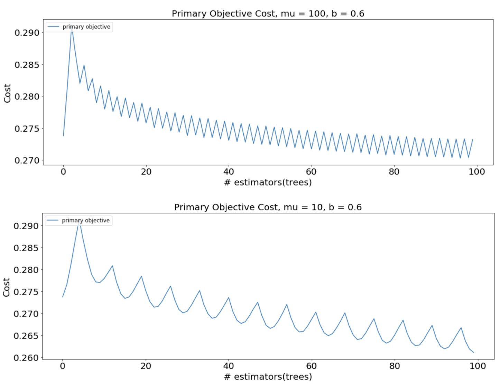

# Multi-objective Optimized GBT(MooGBT)

MooGBT is a library for Multi-objective optimization in Gradient Boosted Trees. MooGBT optimizes for multiple objectives by defining constraints on sub-objective(s) along with a primary objective. The constraints are defined as upper bounds on sub-objective loss function. MooGBT uses a Augmented Lagrangian(AL) based constrained optimization framework with Gradient Boosted Trees, to optimize for multiple objectives.
<br> <br>
 With AL, we introduce dual variables in Boosting. The dual variables are iteratively optimized and fit within the Boosting iterations. The Boosting objective function is updated with the AL terms and the gradient is readily derived using the GBT gradients. With the gradient and updates of dual variables, we solve the optimization problem by jointly iterating AL and Boosting steps.
<br> <br>
This library is motivated by work done in the paper <a href="https://sigir-ecom.github.io/ecom2019/ecom19Papers/paper30.pdf">Multi-objective Relevance Ranking</a>, which introduces an Augmented Lagrangian based method to incorporate multiple objectives (MO) in LambdaMART, which is a GBT based search ranking algorithm.

We have modified the scikit-learn GBT implementation [[3]](#3) to support multi-objective optimization.

<!-- [[1]](#1) -->

Highlights - 
<li> follows the  <a href="https://scikit-learn.org/">scikit-learn</a>  API conventions </li>
<!-- <li> supports natively both dense and sparse data representations </li> -->
<li> supports all hyperparameters present in scikit-learn GBT</li>
<li> supports optimization for more than 1 sub-objectives</li>
<br>

Current support -
<li> MooGBTClassifier - "binomial deviance" loss function, for primary and sub-objectives represented as binary variables </li>
<li> MooGBTRegressor - "least squares" loss function, for primary and sub-objectives represented as continuous variables </li>

<br>

## Installation
Moo-GBT can be installed from **[PyPI](https://pypi.org/project/moo-gbt/)**

 ```python
 pip3 install moo-gbt
 ```
<br>

## Usage

```python
from multiobjective_gbt import MooGBTClassifier

mu = 100
b = 0.7 # upper bound on sub-objective cost

constrained_gbt = MooGBTClassifier(
				loss='deviance',
				n_estimators=100,
				constraints=[{"mu":mu, "b":b}], # One Constraint
				random_state=2021
)
constrained_gbt.fit(X_train, y_train)
```

Here `y_train`  contains 2 columns, the first column should be the primary objective. The following columns are all the sub-objectives for which constraints have been specified(in the same order).

<br>

## Usage Steps
<ol>
	<li> Run unconstrained GBT on Primary Objective. Unconstrained GBT is just the GBTClassifer/GBTRegressor by scikit-learn </li>
	<li> Calculate the loss function value for Primary Objective and sub-objective(s)</li>
		<ul>
			<li>For MooGBTClassifier calculate Log Loss between predicted probability and sub-objective label(s) </li>
			<li>For MooGBTRegressor calculate mean squared error between predicted value and sub-objective label(s) </li>
		</ul>
	<li> Set the value of hyperparamter b, less than the calculated cost in the previous step and run MooGBTClassifer/MooGBTRegressor with this b. The lower the value of b, the more the sub-objective will be optimized </li>
</ol>

<br>

## Example with multiple binary objectives

```python
import pandas as pd
import numpy as np
import seaborn as sns

from multiobjective_gbt import MooGBTClassifier
```

We'll use a publicly available dataset - **[available here](https://www.kaggle.com/c/expedia-hotel-recommendations/data?select=train.csv)**

We define a multi-objective problem on the dataset, with the primary objective as the column "is_booking" and sub-objective as the column "is_package".
Both these variables are binary.

```python
# Preprocessing Data
train_data = pd.read_csv('examples/expedia-data/expedia-hotel-recommendations/train_data_sample.csv')

po = 'is_booking' # primary objective
so = 'is_package' # sub-objective

features =  list(train_data.columns)
features.remove(po)
outcome_flag =  po

# Train-Test Split
X_train, X_test, y_train, y_test = train_test_split(
					train_data[features],
					train_data[outcome_flag],
					test_size=0.2,
					stratify=train_data[[po, so]],
					random_state=2021
)

# Creating y_train_, y_test_ with 2 labels
y_train_ = pd.DataFrame()
y_train_[po] = y_train
y_train_[so] = X_train[so]

y_test_ = pd.DataFrame()
y_test_[po] = y_test
y_test_[so] = X_test[so]
```

MooGBTClassifier without the constraint parameter, works as the standard scikit-learn GBT classifier.

```python
unconstrained_gbt = MooGBTClassifier(
				loss='deviance',
				n_estimators=100,
				random_state=2021
)

unconstrained_gbt.fit(X_train, y_train)
```

Get train and test sub-objective costs for unconstrained model.

```python
def get_binomial_deviance_cost(pred, y):
	return -np.mean(y * np.log(pred) + (1-y) * np.log(1-pred))

pred_train = unconstrained_gbt.predict_proba(X_train)[:,1]
pred_test = unconstrained_gbt.predict_proba(X_test)[:,1]

# get sub-objective costs
so_train_cost = get_binomial_deviance_cost(pred_train, X_train[so])
so_test_cost = get_binomial_deviance_cost(pred_test, X_test[so])

print (f"""
Sub-objective cost train - {so_train_cost},
Sub-objective cost test  - {so_test_cost}
""")
```

    Sub-objective cost train - 0.9114,
    Sub-objective cost test  - 0.9145

Constraint is specified as an upper bound on the sub-objective cost.
In the unconstrained model, we see the cost of our sub-objective to be ~0.9. So setting upper bounds below 0.9 would optimise the sub-objective.

```python
b = 0.65 # upper bound on cost
mu = 100
constrained_gbt = MooGBTClassifier(
				loss='deviance',
				n_estimators=100,
				constraints=[{"mu":mu, "b":b}], # One Constraint
				random_state=2021
)

constrained_gbt.fit(X_train, y_train_)
```

From the constrained model, we achieve more than 100% gain in AuROC for the sub-objective while the loss in primary objective AuROC is kept within 6%.
The entire study on this dataset can be found in the [example notebook](https://github.com/Swiggy/Moo-GBT/blob/master/examples/Constrained_classifer_example.ipynb).

## Looking at MooGBT primary and sub-objective losses - 

To get raw values of loss functions wrt boosting iteration,

``` python
# return a Pandas dataframe with loss values of objectives wrt boosting iteration
losses = constrained_gbt.loss_.get_losses()
losses.head()
```


Similarly, you can also look at dual variable(alpha) values for sub-objective(s),

To get raw values of alphas wrt boosting iteration,
``` python
constrained_gbt.loss_.get_alphas()
```

These losses can be used to look at the MooGBT Learning process.

``` python
sns.lineplot(data=losses, x='n_estimators', y='primary_objective', label='primary objective')
sns.lineplot(data=losses, x='n_estimators', y='sub_objective_1', label='subobjective')

plt.xlabel("# estimators(trees)")
plt.ylabel("Cost")
plt.legend(loc = "upper right")
```


```python
sns.lineplot(data=losses, x='n_estimators', y='primary_objective', label='primary objective')
```


## Choosing the right upper bound constraint `b` and `mu` value

The upper bound should be defined based on a acceptable % loss in the primary objective evaluation metric. For stricter upper bounds, this loss would be greater as MooGBT will optimize for the sub-objective more.<br>

Below table summarizes the effect of the upper bound value on the model performance for primary and sub-objective(s) for the above example. <br>

%gain specifies the percentage increase in AUROC for the constrained MooGBT model from an uncostrained GBT model.


|   b  | Primary Objective - %gain | Sub-Objective - %gain|
|:----:|:-----------------:|:-------------:|
|  0.9 |      -0.7058      |     4.805     |
|  0.8 |       -1.735      |     40.08     |
|  0.7 |      -2.7852      |    62.7144    |
| 0.65 |      -5.8242      |    113.9427   |
|  0.6 |      -9.9137      |    159.8931   |


In general, across our experiments we have found that lower values of `mu` optimize on the primary objective better while satisfying the sub-objective constraints given enough boosting iterations(n_estimators).

The below table summarizes the results of varying `mu` values keeping the upper bound same(b=0.6).

|  b  |  mu  | Primary Objective - %gain | Sub-objective - %gain |
|:---:|:----:|:-----------------------:|:-----------------------:|
| 0.6 | 1000 |         -20.6569        |         238.1388        |
| 0.6 |  100 |         -13.3769        |         197.8186        |
| 0.6 |  10  |         -9.9137         |         159.8931        |
| 0.6 |   5  |          -8.643         |         146.4171        |


<!--  -->

<!-- Above plot shows the Primary Objective Cost wrt Boosting iteration, low mu value is optimizing for primary objective better. -->

## MooGBT Learning Process

MooGBT optimizes for multiple objectives by defining constraints on sub-objective(s) along with a primary objective. The constraints are defined as upper bounds on sub-objective loss function.

MooGBT differs from a standard GBT in the loss function it optimizes the primary objective C<sub>1</sub> and the sub-objectives using the Augmented Lagrangian(AL) constrained optimization approach.


where α = [α1, α2, α3…..] is a vector of dual variables. The Lagrangian is solved by minimizing with respect to the primal variables "s" and maximizing with respect to the dual variables α. Augmented Lagrangian iteratively solves the constraint optimization. 
Since AL is an iterative approach we integerate it with the boosting iterations of GBT for updating the dual variable α.

Alpha(α) update -


At an iteration k, if the constraint t is not satisfied, i.e., C<sub>t</sub>(s) > b<sub>t</sub>, we have 
α<sup>t</sup><sub>k</sub> > α<sup>t</sup><sub>k-1</sub>. Otherwise, if the constraint is met, the dual variable α is made 0.


## Public contents

*   [__gb_.py](https://github.com/Swiggy/Moo-GBT/blob/master/src/multiobjective_gbt/_gb.py):
    contains the `MooGBTClassifier` and `MooGBTRegressor` classes. Contains implementation of the fit and predict function. Extended implementation from [__gb_.py](https://github.com/scikit-learn/scikit-learn/blob/main/sklearn/ensemble/_gb.py) from scikit-learn. 

*   [__gb_losses_.py](https://github.com/Swiggy/Moo-GBT/blob/master/src/multiobjective_gbt/_gb_losses.py):
    contains `BinomialDeviance` loss function class, `LeastSquares` loss function class. Extended implementation from [_gb_losses.py](https://github.com/scikit-learn/scikit-learn/blob/main/sklearn/ensemble/_gb_losses.py) from scikit-learn. 


## More examples

The
[examples](https://github.com/Swiggy/Moo-GBT/tree/master/examples)
directory contains several illustrations of how one can use this library:

*   [Jupyter](https://jupyter.org/) notebooks:

    1.  [Constrained_classifer_example.ipynb](https://github.com/Swiggy/Moo-GBT/blob/master/examples/Constrained_classifer_example.ipynb):
        This notebook runs MooGBTClassifier for a primary objective and a single sub-objective. Both objectives are represented as binary variable.

    <!-- 1.  [Constrained_regressor_example.ipynb](https://github.com/): -->


<!-- ## References
<a id="1">[1]</a> Michinari Momma, Alireza Bagheri Garakani, Yi Sun 
Multi-objective Relevance Ranking 

Communications of the ACM, 11(3), 147-148.

Multi-objective Ranking via Constrained Optimization -->
        
## References - 
<a id="1">[1]</a> Multi-objective Ranking via Constrained Optimization - https://arxiv.org/pdf/2002.05753.pdf <br>
<a id="2">[2]</a> Multi-objective Relevance Ranking - https://sigir-ecom.github.io/ecom2019/ecom19Papers/paper30.pdf <br>
<a id="3">[3]</a> Scikit-learn GBT Implementation - <a href="https://scikit-learn.org/stable/modules/generated/sklearn.ensemble.GradientBoostingClassifier.html">GBTClassifier </a> and <a href="https://scikit-learn.org/stable/modules/generated/sklearn.ensemble.RandomForestRegressor.html#sklearn.ensemble.RandomForestRegressor">GBTRegressor </a>
